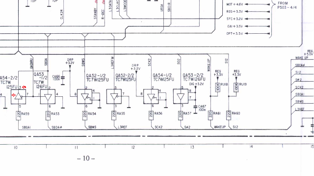

# [Home](../..)/[Documentation](..)/[Service Manuals](.)
This directory contains a number of service manuals for various DCC recorders and players of various brands. Most of the service manuals were downloaded from the Internet.

Additionally, there's a list of [DCC Repair Bulletins](philips_dcc_repair_bulletins.txt), obtained via the [TapeHeads forum](http://www.tapeheads.net/showthread.php?t=50502) containing some interesting repair information, and some secrets e.g. about a TOC feature that didn't make it into the DCC-900.
 
## [Marantz DD82/DD92](./marantz_dd82_dd92.pdf)
Marantz' two first DCC recorders were the DD82 and DD92 which are identical except for the color of the enclosure. Because they used the TDA1547 D/A converter, they are generally praised as the DCC recorders with the best audio quality.

(First generation)

## [Optimus DCT-2000 (part 1)](./optimus_dct-2000_1.pdf) [(part 2)](./optimus_dct-2000_2.pdf)
This is the DCC recorder that RadioShack sold in the United States and elsewhere. These documents are not complete service manuals but do give some information. Most of the DCT-2000 was developed by Optimus/RadioShack (probably RCA/Thompson) but they used a mechanism and two plugin boards from Philips.

(First generation)

## [Philips DCC-91/DCC-450](./70dcc091.pdf)
This was a recorder that was intended to go with/into the FW-91 "MIDI" system. The recorder is technically similar to the DCC-300, DCC-380 and DCC-600.

(Second generation)

## [Philips DCC-130](./philips_dcc130.pdf)
This was the first portable DCC player (it couldn't record). Developed by Matsushita?

(First generation)

## [Philips DCC-134](./philips_dcc134.pdf)
18-bit portable DCC player developed by Marantz. No recording possibility, and also doesn't display track/title information for super-user tapes.

(Third generation)

## [Philips DCC-170](./philips_dcc170.pdf)
18-bit portable DCC recorder developed by Marantz. Doesn't support track/title display for super-user tapes.

(Third generation)

## [Philips DCC175/DCC170](./philips_dcc175_dcc170.pdf)
The DCC-175 was an 18 bit portable DCC recorder developed by Marantz. No support for track/title display for super-user tapes (only for prerecorded tapes), but it can be connected to a computer using the PC-link cable. The mechanism is identical to the DCC-170 and there are commonalities in the schematics between the DCC-170 and DCC-175 too, but it's not possible to hack the DCC-170 to make it into a DCC-175: the PCB designs are very different.
   
The DCC-175 service manual consisted of the DCC-170 manual with a few dozen pages describing the differences between the DCC-175 and the DCC-170. Waling Tiersma provided a paper copy of the service manual, and Jac Goudsmit scanned it at the highest resolution that his dad's scanner supported: 300dpi.

(Third generation)

### [Now in PDF format!](./philips_dcc175_dcc170.pdf)
(2018-07-31) Unfortunately the qualtiy of the [original scans](./DCC170%20DCC175%20Service%20Manual.zip) might not be what one would expect in 2018. They were processed as follows:

- Converted all the files to uncompressed BMP format to minimize the chance of adding more compression artefacts along the way
- Stitched the fold-out pages together
- Adjusted the color balance of the pages that were scanned in color (my dad's scanner's calibration was off, and I knew it but I couldn't do anything about it at the time)
- Enlarged the black-and-white images which were made at 150dpi so they all end up being the same scale
- Enlarged the pages so they all have a matching height of 3440 pixels
- Converted all the files back to JPEG (I tried various settings to get the best quality)
- Converted the JPEGs to PDF.

I used IrfanView, Microsoft Image Composite Editor and convert-jpg-to-pdf.net. I considered using a filter to remove the JPEG artefacts but I decided not to, because I was afraid it would remove too much detail. That may have made the PDF larger than needed but since this service manual seems to be extremely rare, it seems like it would be the right decision. 

### Known errata

On page 010.jpg, near the bottom, there are 8 buffers drawn, six of which are used to buffer the signals to the PC-link connector (which is on page 011.jpg, bottom right). The buffer for SBDAI (QA54-2/2, grid reference I10) is drawn the wrong way and a pin numbers is wrong: The output is pin 3, not 2 and data goes from the bottom to the top.

The diagram above shows the correct direction and pin number near the little red arrows.

## [Philips DCC-300](./philips_dcc300.pdf)
Narrow format DCC recorder, similar to the DCC-380, DCC-450 and DCC-600. This is not a full service manual but some additional information.

(Second generation)

## [Philips DCC-600](./philips_dcc600.pdf)
Stationary recorder with sideways drawer, similar to DCC-300, DCC-380 and DCC-450.

(Second generation)

## [Philips DCC-730](./philips_dcc730.pdf)
18 bit DCC recorder with support for super-user tapes. Had a Turbo Drive mechanism for fast wind/rewind. Virtually identical to the DCC-951 except some connections were missing (not populated) and it had a 14-segment display.

(Third generation)

## [Philips DCC-811/DCC-821](./philips_dcc811_dcc821.pdf)
Car stereo with DCC player.

(First generation)

## [Philips DCC-822/DCC-824 (partial)](22DC822.zip)
Some scanned pages from this car stereo with DCC player (the DCC-824 is identical to the DCC-822 but was sold with the optional wired remote control), but not the entire service manual. Unfortunately no information about the DCC drive (that was probably a separate document anyway).

Thanks Ron Jacobs for sending us what you had. If you can provide a better version, please contact the DCC Museum!

(Third generation)

## [Philips DCC-900](./philips_dcc900.pdf)
The first DCC recorder

(First generation)

## [Philips DCC-951](./philips_dcc951.pdf) and [addendum: Circuit Description](./philips_dcc951_circuit_description.pdf)
18 bit DCC recorder with support for super-user tapes. Had a Turbo Drive mechanism for fast wind/rewind. Virtually identical to the DCC-730 but it had some extra connections for the 900-series remote control bus, and it had a dot-matrix display.

The circuit description document is an addendum to the DCC-951 service manual, but is mostly about the DCC Deck Unit (DDU-2113) that was used in the DCC-951 and DCC-730. The document makes it clear without a doubt that by 1993, Philips was trying hard to make the Turbo Drive mechanism with the 3rd generation chipset a standard in the world. This document, intended for service technicians and service trainers, plus the datasheets for the third-generation chipset, are a great source of information about the DCC standard and how a DCC recorder works. Definitely worth a read!

(Third generation)

## [Philips FW-68](./philips_fw68.pdf)
A mini stereo system with radio tuner, CD player, analog cassette recorder and DCC recorder all integrated into one device. It doesn't have a text display so it can't show (or record) track titles. It's the only front loading DCC recorder that Philips produced (the DCC-850 and DCC-771 double-deck were also front loaders but they never went into production).

(Third generation)

## [Technics RS-DC8](./technics_rs-dc8.pdf)
Stationary DCC recorder developed by Matsushita, using their own chipset. This recorder has many features such as the ability to store 4 texts with each track. The schematic hints at the possibility that Matsushita may have been working on a longplay DCC format at the time of the demise of DCC. Lots of extra information in this service manual; worth reading if you're new to DCC. 

(Third generation)

## [Technics RS-DC10](./technics_rs-dc10.pdf)
Stationary DCC recorder, virtually identical to the Philips DCC-900. Lots of extra information in this service manual; worth reading if you're new to DCC.

(First generation)
